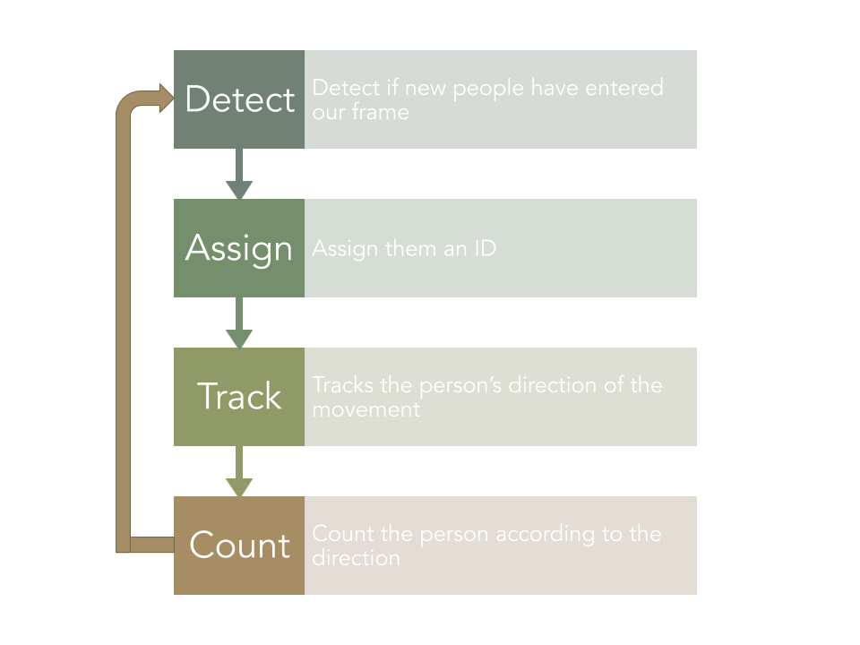

## Study Project - Citizen Science for Image Recognition

### Image Recognition for Citizen Science TRACKING INDOOR MOVEMENTS 

#### Aim
To track the movement of individuals entering a building and count them according to their direction.

#### Case Study
Institute for Geoinformatics (IFGI)

#### Project Steps

#### Possible Applications
Museums, Hospitals, Service Centers, Health Clinics, Government Offices, and other buildings.

